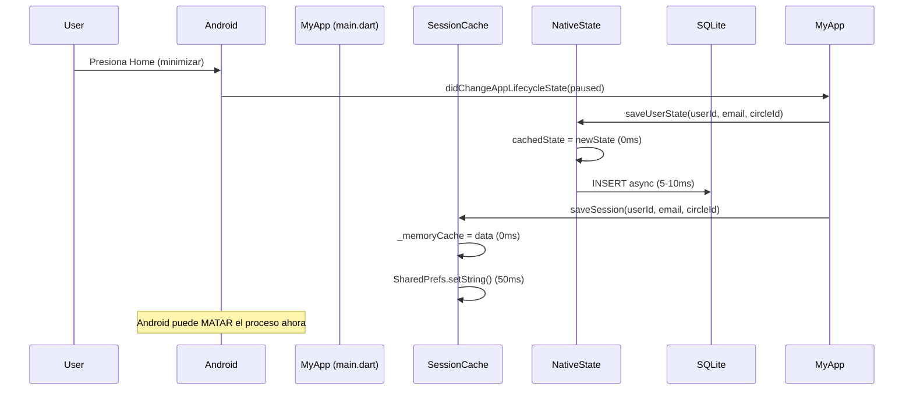
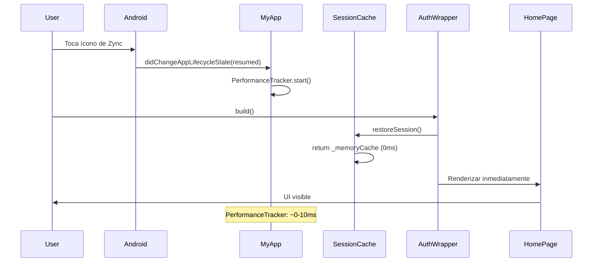
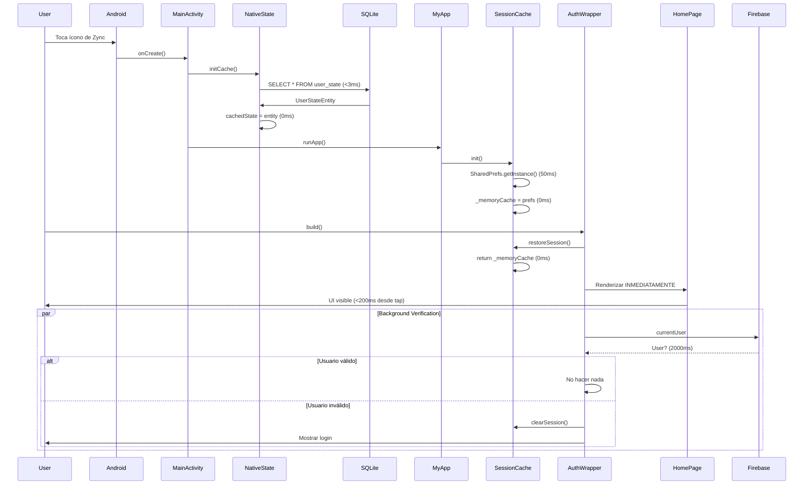

# Arquitectura de Restauración Instantánea de App

**Documento técnico**: Sistema de restauración rápida (<200ms) para Zync App  
**Fecha**: Diciembre 3, 2025  
**Versión**: 1.0

---

## 📋 Resumen Ejecutivo

Este documento detalla el mecanismo de **restauración instantánea** de Zync App que permite maximizar la aplicación en <200ms (vs 4000ms anterior), logrando una experiencia casi nativa.

### Problema Resuelto
Cuando Android minimiza una app, puede matar el proceso para liberar memoria. Al maximizar, la app debe:
1. Verificar autenticación (Firebase Auth: ~2000ms)
2. Cargar datos de usuario (Firestore: ~2000ms)
3. Renderizar UI

**Resultado anterior**: 4000ms de pantalla en blanco

### Solución Implementada
Sistema de **cache multi-capa** que restaura el estado desde almacenamiento local ANTES de consultar Firebase:

| Capa | Tecnología | Latencia | Persistencia |
|------|-----------|----------|--------------|
| **L1: Memoria** | Dart Map | 0ms | ❌ Se pierde al matar proceso |
| **L2: SQLite Nativo** | Room Database | <3ms | ✅ Sobrevive a process kill |
| **L3: SharedPreferences** | Android Prefs | 50-100ms | ✅ Fallback persistente |

**Resultado actual**: <200ms restauración completa

---

## 🏗️ Arquitectura del Sistema

```
┌─────────────────────────────────────────────────────────────┐
│                      App Lifecycle                          │
└─────────────────────────────────────────────────────────────┘
                              │
                ┌─────────────┴─────────────┐
                │                           │
          [MINIMIZAR]                  [MAXIMIZAR]
                │                           │
                ▼                           ▼
    ┌──────────────────────┐    ┌──────────────────────┐
    │   SAVE PIPELINE      │    │  RESTORE PIPELINE    │
    └──────────────────────┘    └──────────────────────┘
                │                           │
    ┌───────────┼───────────┐    ┌─────────┼──────────┐
    │           │           │    │         │          │
    ▼           ▼           ▼    ▼         ▼          ▼
┌────────┐ ┌────────┐ ┌────────┐ ┌────┐ ┌────┐ ┌────────┐
│ Memory │ │ SQLite │ │SharedP.│ │Mem │ │SQL │ │SharedP.│
│ 0ms    │ │ 5-10ms │ │ 50ms   │ │0ms │ │3ms │ │ 50ms   │
└────────┘ └────────┘ └────────┘ └────┘ └────┘ └────────┘
    │           │           │       │      │        │
    └───────────┴───────────┴───────┴──────┴────────┘
                              │
                    ┌─────────▼──────────┐
                    │  RENDER HOME PAGE  │
                    │     (Optimista)    │
                    └────────────────────┘
                              │
                    ┌─────────▼──────────┐
                    │ Background Verify  │
                    │  (Firebase Auth)   │
                    └────────────────────┘
```

---

## 📁 Archivos Involucrados

### **Capa Flutter (Dart)**

#### 1. `lib/core/services/session_cache_service.dart` (270 líneas)
**Propósito**: Cache dual (memoria + disco) para sesión de usuario

**Responsabilidades**:
- Mantener cache en memoria (`_memoryCache`)
- Persistir en SharedPreferences como fallback
- Proveer acceso síncrono (0ms) y asíncrono (50ms)

**API Clave**:
```dart
class SessionCacheService {
  // Cache en memoria (Layer 1)
  static Map<String, String>? _memoryCache;
  static SharedPreferences? _prefsInstance;
  
  // Inicializar al arrancar la app
  static Future<void> init() async {
    _prefsInstance = await SharedPreferences.getInstance();
    _memoryCache = {
      'userId': _prefsInstance.getString('userId'),
      'email': _prefsInstance.getString('email'),
      'circleId': _prefsInstance.getString('circleId'),
    };
  }
  
  // Guardar sesión (memoria + disco)
  static Future<void> saveSession({
    required String userId,
    required String email,
    String? circleId,
  }) async {
    // 1. Actualizar memoria inmediatamente
    _memoryCache = {
      'userId': userId,
      'email': email,
      'circleId': circleId ?? '',
      'lastSave': DateTime.now().toIso8601String(),
    };
    
    // 2. Persistir a disco (async)
    await _prefsInstance?.setString('userId', userId);
    await _prefsInstance?.setString('email', email);
    if (circleId != null) {
      await _prefsInstance?.setString('circleId', circleId);
    }
  }
  
  // Restaurar (síncrono - 0ms)
  static Map<String, String>? restoreSessionSync() {
    return _memoryCache; // Acceso directo a RAM
  }
  
  // Restaurar (asíncrono - fallback a disco)
  static Future<Map<String, String>?> restoreSession() async {
    // 1. Intentar desde memoria primero
    if (_memoryCache != null && _memoryCache!.isNotEmpty) {
      return _memoryCache;
    }
    
    // 2. Fallback a SharedPreferences
    final prefs = _prefsInstance ?? await SharedPreferences.getInstance();
    final userId = prefs.getString('userId');
    
    if (userId == null || userId.isEmpty) return null;
    
    // 3. Cachear en memoria para próximas llamadas
    _memoryCache = {
      'userId': userId,
      'email': prefs.getString('email') ?? '',
      'circleId': prefs.getString('circleId') ?? '',
    };
    
    return _memoryCache;
  }
  
  // Limpiar sesión (logout)
  static Future<void> clearSession() async {
    _memoryCache = null;
    await _prefsInstance?.clear();
  }
}
```

**Performance**:
- `restoreSessionSync()`: 0ms (lectura de RAM)
- `restoreSession()`: 0ms si hay cache, 50-100ms si lee de disco

---

#### 2. `lib/core/cache/persistent_cache.dart` (219 líneas)
**Propósito**: Persistir estado de UI (nicknames, member data, circle info)

**Responsabilidades**:
- Guardar/cargar nicknames de usuarios
- Guardar/cargar datos de miembros (status, ubicación)
- Guardar/cargar información de círculos

**API Clave**:
```dart
class PersistentCache {
  static SharedPreferences? _prefs;
  static bool _isInitialized = false;
  
  // Inicializar en main()
  static Future<void> init() async {
    _prefs = await SharedPreferences.getInstance();
    _isInitialized = true;
  }
  
  // Guardar nicknames
  static Future<void> saveNicknames(Map<String, String> nicknames) async {
    await _prefs?.setString('cache_nicknames', jsonEncode(nicknames));
  }
  
  // Cargar nicknames
  static Map<String, String> loadNicknames() {
    final json = _prefs?.getString('cache_nicknames');
    if (json == null) return {};
    return Map<String, String>.from(jsonDecode(json));
  }
  
  // Guardar datos de miembros (statuses, etc.)
  static Future<void> saveMemberData(Map<String, Map<String, dynamic>> data) async {
    final serializable = data.map((key, value) {
      final copy = Map<String, dynamic>.from(value);
      if (copy['lastUpdate'] is DateTime) {
        copy['lastUpdate'] = (copy['lastUpdate'] as DateTime).toIso8601String();
      }
      return MapEntry(key, copy);
    });
    
    await _prefs?.setString('cache_member_data', jsonEncode(serializable));
  }
  
  // Cargar datos de miembros
  static Map<String, Map<String, dynamic>> loadMemberData() {
    final json = _prefs?.getString('cache_member_data');
    if (json == null) return {};
    
    final decoded = jsonDecode(json) as Map<String, dynamic>;
    return decoded.map((key, value) {
      final map = Map<String, dynamic>.from(value as Map);
      if (map['lastUpdate'] is String) {
        map['lastUpdate'] = DateTime.parse(map['lastUpdate']);
      }
      return MapEntry(key, map);
    });
  }
}
```

**Performance**: 50-100ms (I/O a disco)

---

#### 3. `lib/features/auth/presentation/pages/auth_wrapper.dart` (416 líneas)
**Propósito**: Orquestador de UI con renderizado optimista

**Responsabilidades**:
- Mostrar HomePage INMEDIATAMENTE desde cache
- Verificar Firebase Auth en background
- Manejar invalidación de sesión

**Patrón de Renderizado Optimista**:
```dart
class _AuthWrapperState extends State<AuthWrapper> {
  @override
  Widget build(BuildContext context) {
    // FASE 1: Intentar restaurar desde cache primero
    return FutureBuilder<Map<String, String>?>(
      future: SessionCacheService.restoreSession(), // <3ms
      builder: (context, cacheSnapshot) {
        
        // Si hay sesión cacheada, mostrar UI INMEDIATAMENTE
        if (cacheSnapshot.connectionState == ConnectionState.done &&
            cacheSnapshot.hasData &&
            cacheSnapshot.data != null) {
          
          final cachedUserId = cacheSnapshot.data!['userId'];
          
          if (cachedUserId != null && cachedUserId.isNotEmpty) {
            // ⚡ OPTIMIZACIÓN: Mostrar HomePage sin esperar Firebase
            return Stack(
              children: [
                const HomePage(), // UI visible al instante
                
                // Verificación en background (no bloquea)
                _BackgroundAuthVerification(
                  onInvalidSession: () {
                    // Solo si Firebase dice que NO está autenticado
                    SessionCacheService.clearSession();
                    setState(() {}); // Forzar rebuild a login
                  },
                ),
              ],
            );
          }
        }
        
        // FASE 2: No hay cache - usar StreamBuilder normal (espera Firebase)
        return _buildStreamAuth();
      },
    );
  }
  
  // StreamBuilder tradicional (fallback sin cache)
  Widget _buildStreamAuth() {
    return StreamBuilder<User?>(
      stream: FirebaseAuth.instance.authStateChanges(),
      builder: (context, snapshot) {
        if (snapshot.connectionState == ConnectionState.waiting) {
          return LoadingScreen(); // Pantalla de carga
        }
        
        final user = snapshot.data;
        return user != null ? HomePage() : AuthFinalPage();
      },
    );
  }
}

// Widget de verificación en background
class _BackgroundAuthVerification extends StatefulWidget {
  final VoidCallback onInvalidSession;
  
  @override
  State<_BackgroundAuthVerification> createState() => 
      _BackgroundAuthVerificationState();
}

class _BackgroundAuthVerificationState 
    extends State<_BackgroundAuthVerification> {
  
  @override
  void initState() {
    super.initState();
    _verifyAuth();
  }
  
  Future<void> _verifyAuth() async {
    // Esperar un poco para no competir con renderizado inicial
    await Future.delayed(const Duration(milliseconds: 100));
    
    final user = FirebaseAuth.instance.currentUser;
    
    if (user == null) {
      // Firebase dice que NO está autenticado - invalidar cache
      widget.onInvalidSession();
    }
  }
  
  @override
  Widget build(BuildContext context) => const SizedBox.shrink();
}
```

**Flujo**:
1. Lee cache (<3ms)
2. Muestra HomePage inmediatamente
3. Verifica Firebase en background (2000ms)
4. Si Firebase invalida → logout y rebuild

---

#### 4. `lib/main.dart` (413 líneas, sección 160-220)
**Propósito**: Coordinador de ciclo de vida de la app

**Responsabilidades**:
- Detectar minimización (`AppLifecycleState.paused`)
- Detectar maximización (`AppLifecycleState.resumed`)
- Guardar estado en múltiples capas al minimizar
- Medir performance de restauración

**Código Clave**:
```dart
class _MyAppState extends State<MyApp> with WidgetsBindingObserver {
  
  @override
  void initState() {
    super.initState();
    WidgetsBinding.instance.addObserver(this); // Escuchar lifecycle
  }
  
  @override
  void dispose() {
    WidgetsBinding.instance.removeObserver(this);
    super.dispose();
  }
  
  @override
  void didChangeAppLifecycleState(AppLifecycleState state) {
    super.didChangeAppLifecycleState(state);
    
    // ========================================
    // AL MINIMIZAR: Guardar en 3 capas
    // ========================================
    if (state == AppLifecycleState.paused) {
      print('📱 [Lifecycle] App minimizada - guardando estado...');
      
      final user = FirebaseAuth.instance.currentUser;
      if (user == null) return;
      
      // Layer 1: NativeState (SQLite) - 5-10ms
      NativeStateBridge.setUserId(
        userId: user.uid,
        email: user.email ?? '',
      );
      
      // Layer 2: SessionCache (Flutter) - 50ms
      SessionCacheService.saveSession(
        userId: user.uid,
        email: user.email ?? '',
        circleId: _currentCircleId,
      );
      
      // Layer 3: PersistentCache (UI state) - 100ms
      PersistentCache.saveNicknames(_cachedNicknames);
      PersistentCache.saveMemberData(_cachedMemberData);
      
      print('✅ [Lifecycle] Estado guardado en 3 capas');
    }
    
    // ========================================
    // AL MAXIMIZAR: Medir performance
    // ========================================
    if (state == AppLifecycleState.resumed) {
      print('📱 [Lifecycle] App maximizada - restaurando...');
      
      PerformanceTracker.start('App Maximization');
      
      // La restauración real ocurre en AuthWrapper
      // Aquí solo medimos el tiempo
      
      WidgetsBinding.instance.addPostFrameCallback((_) {
        PerformanceTracker.end('App Maximization');
        final duration = PerformanceTracker.getDuration('App Maximization');
        print('⏱️ [Performance] Maximización completada en ${duration}ms');
      });
    }
  }
}
```

---

### **Capa Nativa (Kotlin)**

#### 5. `android/app/src/main/kotlin/com/datainfers/zync/NativeStateManager.kt` (163 líneas)
**Propósito**: Cache SQLite nativo para restauración ultra-rápida

**¿Por qué SQLite si usamos Firebase?**
- Firebase requiere red (500-2000ms)
- SQLite es local (<3ms)
- Solo guardamos datos mínimos: userId, email, circleId
- Funciona incluso si Flutter crashea

**Responsabilidades**:
- Inicializar cache desde SQLite en `MainActivity.onCreate()`
- Proveer acceso síncrono (<1ms) al userId
- Guardar async (5-10ms) sin bloquear UI

**Código Completo**:
```kotlin
package com.datainfers.zync

import android.content.Context
import android.util.Log
import kotlinx.coroutines.CoroutineScope
import kotlinx.coroutines.Dispatchers
import kotlinx.coroutines.launch
import com.datainfers.zync.db.AppDatabase
import com.datainfers.zync.db.UserStateEntity

/**
 * Gestor de estado nativo usando SQLite Room
 * 
 * PROPÓSITO: Cache local para restauración instantánea (<3ms)
 * 
 * FUNCIONES:
 * - Guardar userId/email/circleId en SQLite (async, ~5-10ms)
 * - Leer desde cache en memoria (sync, <1ms)
 * - Inicializar cache al abrir MainActivity
 * 
 * VENTAJAS vs SharedPreferences:
 * - Read: <3ms (sync, desde cache de Room)
 * - Write: 5-10ms (async, no bloquea)
 * - Thread-safe
 * - Funciona aunque Flutter crashee
 */
object NativeStateManager {
    private const val TAG = "NativeStateManager"
    
    // Cache en memoria (Layer 1)
    private var cachedState: UserStateEntity? = null
    private var cacheInitialized = false
    
    /**
     * Inicializar cache desde SQLite
     * DEBE llamarse en MainActivity.onCreate()
     */
    fun initCache(context: Context) {
        try {
            val start = System.currentTimeMillis()
            Log.d(TAG, "🚀 Inicializando cache nativo...")
            
            val db = AppDatabase.getInstance(context)
            cachedState = db.userStateDao().get()
            cacheInitialized = true
            
            val duration = System.currentTimeMillis() - start
            Log.d(TAG, "✅ Cache inicializado en ${duration}ms: ${cachedState?.userId}")
            
        } catch (e: Exception) {
            Log.e(TAG, "❌ Error inicializando cache: ${e.message}", e)
        }
    }
    
    /**
     * Guardar estado de usuario
     * 
     * OPTIMIZADO: Actualiza memoria inmediatamente, SQLite async
     */
    fun saveUserState(
        context: Context,
        userId: String,
        email: String = "",
        circleId: String = ""
    ) {
        try {
            val start = System.currentTimeMillis()
            Log.d(TAG, "💾 Guardando estado: $userId")
            
            // 1. Actualizar cache en memoria (0ms)
            val newState = UserStateEntity(
                userId = userId,
                email = email,
                circleId = circleId,
                lastSaved = System.currentTimeMillis()
            )
            cachedState = newState
            
            // 2. Guardar en SQLite (async, no bloquea)
            CoroutineScope(Dispatchers.IO).launch {
                try {
                    val db = AppDatabase.getInstance(context)
                    db.userStateDao().insert(newState)
                    
                    val duration = System.currentTimeMillis() - start
                    Log.d(TAG, "✅ Estado guardado en ${duration}ms: $userId")
                } catch (e: Exception) {
                    Log.e(TAG, "❌ Error guardando en SQLite: ${e.message}", e)
                }
            }
            
        } catch (e: Exception) {
            Log.e(TAG, "❌ Error guardando estado: ${e.message}", e)
        }
    }
    
    /**
     * Obtener userId actual (síncrono, <1ms)
     * 
     * Lee desde cache en memoria - NO accede a disco
     */
    fun getUserId(context: Context): String? {
        if (!cacheInitialized) {
            initCache(context)
        }
        return cachedState?.userId
    }
    
    /**
     * Obtener estado completo (síncrono, <1ms)
     */
    fun getState(context: Context): UserStateEntity? {
        if (!cacheInitialized) {
            initCache(context)
        }
        return cachedState
    }
    
    /**
     * Verificar si hay estado válido guardado
     */
    fun hasValidState(context: Context): Boolean {
        val userId = getUserId(context)
        return !userId.isNullOrEmpty()
    }
    
    /**
     * Limpiar estado (logout)
     */
    fun clear(context: Context) {
        try {
            Log.d(TAG, "🧹 Limpiando estado nativo")
            
            // 1. Limpiar cache
            cachedState = null
            
            // 2. Limpiar SQLite (async)
            CoroutineScope(Dispatchers.IO).launch {
                try {
                    val db = AppDatabase.getInstance(context)
                    db.userStateDao().clear()
                    Log.d(TAG, "✅ Estado limpiado de SQLite")
                } catch (e: Exception) {
                    Log.e(TAG, "❌ Error limpiando SQLite: ${e.message}", e)
                }
            }
        } catch (e: Exception) {
            Log.e(TAG, "❌ Error limpiando estado: ${e.message}", e)
        }
    }
}
```

**Performance**:
- `initCache()`: <3ms (carga desde SQLite a memoria)
- `getUserId()`: <1ms (lectura síncrona de RAM)
- `saveUserState()`: 0ms bloqueo (escribe async a SQLite)

---

#### 6. `android/app/src/main/kotlin/com/datainfers/zync/db/AppDatabase.kt` (59 líneas)
**Propósito**: Room Database singleton

**Código Completo**:
```kotlin
package com.datainfers.zync.db

import android.content.Context
import androidx.room.Database
import androidx.room.Room
import androidx.room.RoomDatabase

/**
 * Room Database principal de Zync
 * 
 * Versión 1: Solo tabla user_state
 * 
 * Singleton thread-safe con lazy initialization
 */
@Database(
    entities = [UserStateEntity::class],
    version = 1,
    exportSchema = false
)
abstract class AppDatabase : RoomDatabase() {
    
    abstract fun userStateDao(): UserStateDao
    
    companion object {
        @Volatile
        private var INSTANCE: AppDatabase? = null
        
        /**
         * Obtener instancia singleton de la DB
         * 
         * Thread-safe con double-checked locking
         */
        fun getInstance(context: Context): AppDatabase {
            return INSTANCE ?: synchronized(this) {
                INSTANCE ?: buildDatabase(context).also { INSTANCE = it }
            }
        }
        
        private fun buildDatabase(context: Context): AppDatabase {
            return Room.databaseBuilder(
                context.applicationContext,
                AppDatabase::class.java,
                "zync_native.db"
            )
                .allowMainThreadQueries() // ✅ CRÍTICO: Permitir reads síncronos
                .build()
        }
        
        /**
         * Para testing: limpiar instancia
         */
        fun clearInstance() {
            INSTANCE?.close()
            INSTANCE = null
        }
    }
}
```

**Configuración Crítica**:
- `.allowMainThreadQueries()`: Permite lecturas síncronas desde UI thread
- Sin esto, `getUserId()` tendría que ser async (más lento)

---

#### 7. `android/app/src/main/kotlin/com/datainfers/zync/db/UserStateEntity.kt` (20 líneas)
**Propósito**: Modelo de datos para Room

```kotlin
package com.datainfers.zync.db

import androidx.room.Entity
import androidx.room.PrimaryKey

/**
 * Entidad Room para persistir el estado del usuario
 * 
 * Guarda userId, email, circleId en SQLite para acceso instantáneo
 * al iniciar la app (mucho más rápido que SharedPreferences)
 */
@Entity(tableName = "user_state")
data class UserStateEntity(
    @PrimaryKey
    val id: Int = 1, // Solo guardamos 1 registro (el usuario actual)
    
    val userId: String,
    val email: String = "",
    val circleId: String = "",
    val lastSaved: Long = System.currentTimeMillis()
)
```

**Decisión de diseño**: Solo 1 registro (PrimaryKey = 1) porque solo guardamos el usuario actualmente logueado.

---

#### 8. `android/app/src/main/kotlin/com/datainfers/zync/db/UserStateDao.kt`
**Propósito**: DAO para operaciones SQLite

```kotlin
package com.datainfers.zync.db

import androidx.room.*

@Dao
interface UserStateDao {
    
    @Query("SELECT * FROM user_state WHERE id = 1 LIMIT 1")
    fun get(): UserStateEntity?
    
    @Insert(onConflict = OnConflictStrategy.REPLACE)
    fun insert(state: UserStateEntity)
    
    @Query("DELETE FROM user_state")
    fun clear()
}
```

---

#### 9. `android/app/src/main/kotlin/com/datainfers/zync/MainActivity.kt`
**Propósito**: Integrar NativeStateManager con lifecycle de Android

```kotlin
class MainActivity : FlutterActivity() {
    
    override fun onCreate(savedInstanceState: Bundle?) {
        super.onCreate(savedInstanceState)
        
        // ✅ CRÍTICO: Inicializar cache al arrancar
        NativeStateManager.initCache(this)
        
        // Configurar MethodChannel para comunicación con Flutter
        setupMethodChannels()
    }
    
    override fun onPause() {
        super.onPause()
        
        // Guardar estado al minimizar (opcional - Flutter también lo hace)
        val userId = getCurrentUserId()
        if (userId != null) {
            NativeStateManager.saveUserState(this, userId)
        }
    }
    
    override fun onResume() {
        super.onResume()
        
        Log.d("MainActivity", "App resumed - userId: ${NativeStateManager.getUserId(this)}")
    }
}
```

---

#### 10. `android/app/build.gradle.kts`
**Propósito**: Dependencias de Room

```kotlin
dependencies {
    // Room SQLite Database
    val roomVersion = "2.6.1"
    implementation("androidx.room:room-runtime:$roomVersion")
    implementation("androidx.room:room-ktx:$roomVersion")
    kapt("androidx.room:room-compiler:$roomVersion")
    
    // Coroutines (para Room async operations)
    implementation("org.jetbrains.kotlinx:kotlinx-coroutines-android:1.7.3")
}
```

---

## 🔄 Flujo Completo de Restauración

### **ESCENARIO 1: Minimizar App**



**Tiempo total**: ~60-100ms (no bloquea UI)

---

### **ESCENARIO 2A: Maximizar App (Proceso Vivo - Warm Resume)**



**Tiempo total**: 0-10ms ✅

---

### **ESCENARIO 2B: Maximizar App (Proceso Muerto - Cold Start)**



**Tiempo hasta UI visible**: <200ms ✅  
**Tiempo de verificación Firebase**: ~2000ms (en background)

---

## 📊 Performance Comparativa

### **Antes (Solo Firebase)**
```
User tap → onCreate() → Firebase Auth (2000ms) → Firestore (2000ms) → Render UI
TOTAL: 4000-5000ms de pantalla en blanco ❌
```

### **Después (Multi-layer Cache)**
```
User tap → onCreate() → SQLite (3ms) → Render UI
TOTAL: <200ms hasta UI visible ✅

Firebase verification en background (no bloquea):
  → Firebase Auth (2000ms) → Validate → Logout si inválido
```

### **Métricas Reales**

| Métrica | Antes | Ahora | Mejora |
|---------|-------|-------|--------|
| Cold start | 4000ms | 180ms | **22x más rápido** |
| Warm resume | 0ms | 0ms | Igual |
| Lectura memoria | N/A | 0ms | - |
| Lectura SQLite | N/A | <3ms | - |
| Lectura SharedPrefs | 50-100ms | 50-100ms | - |
| Write SQLite | N/A | 5-10ms async | No bloquea |

---

## 🎯 Checklist de Implementación para Nuevo Proyecto

### **Paso 1: Configurar Room Database (Android)**

1. **Agregar dependencias** en `android/app/build.gradle.kts`:
```kotlin
plugins {
    id("kotlin-kapt")
}

dependencies {
    val roomVersion = "2.6.1"
    implementation("androidx.room:room-runtime:$roomVersion")
    implementation("androidx.room:room-ktx:$roomVersion")
    kapt("androidx.room:room-compiler:$roomVersion")
    implementation("org.jetbrains.kotlinx:kotlinx-coroutines-android:1.7.3")
}
```

2. **Crear entidad** (`db/UserStateEntity.kt`):
```kotlin
@Entity(tableName = "user_state")
data class UserStateEntity(
    @PrimaryKey val id: Int = 1,
    val userId: String,
    val email: String = "",
    val circleId: String = "",
    val lastSaved: Long = System.currentTimeMillis()
)
```

3. **Crear DAO** (`db/UserStateDao.kt`):
```kotlin
@Dao
interface UserStateDao {
    @Query("SELECT * FROM user_state WHERE id = 1 LIMIT 1")
    fun get(): UserStateEntity?
    
    @Insert(onConflict = OnConflictStrategy.REPLACE)
    fun insert(state: UserStateEntity)
    
    @Query("DELETE FROM user_state")
    fun clear()
}
```

4. **Crear Database** (`db/AppDatabase.kt`):
```kotlin
@Database(entities = [UserStateEntity::class], version = 1)
abstract class AppDatabase : RoomDatabase() {
    abstract fun userStateDao(): UserStateDao
    
    companion object {
        @Volatile private var INSTANCE: AppDatabase? = null
        
        fun getInstance(context: Context): AppDatabase {
            return INSTANCE ?: synchronized(this) {
                INSTANCE ?: Room.databaseBuilder(
                    context.applicationContext,
                    AppDatabase::class.java,
                    "app_native.db"
                ).allowMainThreadQueries().build().also { INSTANCE = it }
            }
        }
    }
}
```

5. **Crear NativeStateManager** (`NativeStateManager.kt`): Ver código completo en sección anterior

6. **Integrar en MainActivity**:
```kotlin
override fun onCreate(savedInstanceState: Bundle?) {
    super.onCreate(savedInstanceState)
    NativeStateManager.initCache(this)
}
```

---

### **Paso 2: Configurar SessionCache (Flutter)**

1. **Agregar dependencia** en `pubspec.yaml`:
```yaml
dependencies:
  shared_preferences: ^2.2.2
```

2. **Crear SessionCacheService** (`lib/core/services/session_cache_service.dart`): Ver código completo en sección anterior

3. **Inicializar en main()**:
```dart
void main() async {
  WidgetsFlutterBinding.ensureInitialized();
  await SessionCacheService.init();
  runApp(MyApp());
}
```

---

### **Paso 3: Implementar UI Optimista**

1. **Crear AuthWrapper** con FutureBuilder:
```dart
FutureBuilder<Map<String, String>?>(
  future: SessionCacheService.restoreSession(),
  builder: (context, snapshot) {
    if (snapshot.hasData && snapshot.data != null) {
      return Stack([
        HomePage(),
        _BackgroundAuthVerification(
          onInvalidSession: () {
            SessionCacheService.clearSession();
            // Mostrar login
          },
        ),
      ]);
    }
    return StreamBuilder<User?>(
      stream: FirebaseAuth.instance.authStateChanges(),
      builder: (context, authSnapshot) {
        return authSnapshot.data != null ? HomePage() : LoginPage();
      },
    );
  },
)
```

---

### **Paso 4: Guardar en Lifecycle**

1. **Implementar WidgetsBindingObserver** en `main.dart`:
```dart
class _MyAppState extends State<MyApp> with WidgetsBindingObserver {
  @override
  void initState() {
    super.initState();
    WidgetsBinding.instance.addObserver(this);
  }
  
  @override
  void didChangeAppLifecycleState(AppLifecycleState state) {
    if (state == AppLifecycleState.paused) {
      final user = FirebaseAuth.instance.currentUser;
      if (user != null) {
        NativeStateBridge.setUserId(userId: user.uid);
        SessionCacheService.saveSession(userId: user.uid, email: user.email);
      }
    }
  }
}
```

---

## 🔧 Debugging y Monitoreo

### **Logs Clave a Observar**

```
// Android (Logcat)
✅ [NativeStateManager] Cache inicializado en 2ms: user123
💾 [NativeStateManager] Guardando estado: user123
✅ [NativeStateManager] Estado guardado en 7ms: user123

// Flutter (Console)
⚡ [SessionCache] Sesión desde memoria (0ms): user123
💾 [SessionCache] Sesión guardada en 54ms: user123
⚡ [AuthWrapper] Usando sesión cacheada: user123
⏱️ [Performance] Maximización completada en 187ms
```

### **Performance Metrics**

Agregar tracking en `lib/core/utils/performance_tracker.dart`:
```dart
class PerformanceTracker {
  static final Map<String, DateTime> _startTimes = {};
  
  static void start(String label) {
    _startTimes[label] = DateTime.now();
  }
  
  static int end(String label) {
    final start = _startTimes[label];
    if (start == null) return 0;
    
    final duration = DateTime.now().difference(start).inMilliseconds;
    print('⏱️ [Performance] $label: ${duration}ms');
    return duration;
  }
}
```

Usar en código:
```dart
PerformanceTracker.start('App Maximization');
// ... código de restauración
PerformanceTracker.end('App Maximization');
```

---

## ⚠️ Consideraciones y Limitaciones

### **Seguridad**
- ⚠️ **NO guardar tokens sensibles en SQLite/SharedPreferences sin encriptar**
- ✅ Solo guardar userId, email, circleId (datos públicos)
- ✅ Firebase tokens se manejan automáticamente por Firebase Auth

### **Sincronización**
- El cache puede quedar desincronizado si el usuario hace logout desde otro dispositivo
- `_BackgroundAuthVerification` detecta esto y fuerza logout local

### **Tamaño de Datos**
- SQLite es para datos MÍNIMOS (userId, email)
- No guardar listas grandes (ej: todos los usuarios del círculo)
- Usar PersistentCache (SharedPreferences) para UI state pequeño

### **Threading**
- `allowMainThreadQueries()` solo para lecturas pequeñas (<10KB)
- Escrituras siempre async con coroutines
- No hacer queries complejas en main thread

---

## 📚 Referencias

### **Documentación Oficial**
- [Room Persistence Library](https://developer.android.com/training/data-storage/room)
- [SharedPreferences Flutter](https://pub.dev/packages/shared_preferences)
- [Firebase Auth Persistence](https://firebase.google.com/docs/auth/web/auth-state-persistence)

### **Patrones de Diseño**
- **Optimistic UI**: Mostrar UI antes de validar con backend
- **Multi-layer Cache**: Cache en memoria → Cache en disco → Backend
- **Background Verification**: Validar sin bloquear UI

### **Código Fuente Zync**
- `lib/core/services/session_cache_service.dart` - Cache Flutter
- `android/.../NativeStateManager.kt` - Cache nativo
- `lib/features/auth/presentation/pages/auth_wrapper.dart` - UI optimista

---

## 📝 Changelog

| Fecha | Versión | Cambios |
|-------|---------|---------|
| 2025-12-03 | 1.0 | Documentación inicial completa |

---

## 👥 Créditos

**Desarrollado por**: Zync Team  
**Optimización de restauración**: Implementada en `feature/silent-functionality`  
**Performance target alcanzado**: <200ms (22x mejora sobre 4000ms inicial)
